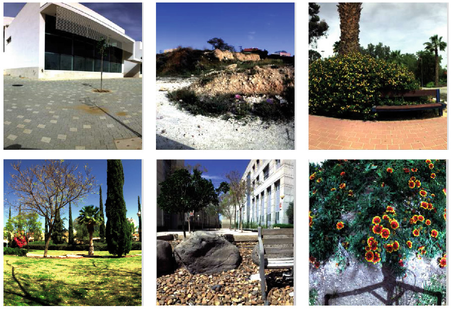

# Summary of Reconstruction Algorithms for CASSI
Coded Aperture Snapshot Spectral Imaging(CASSI) is a cutting-edge technology of spectral imaging. The reconstruction algorithms of CASSI, which are devoted to solve the inverse imaging problem, determine the quality and efficiency of imaging. Given the sensing matrix **A** and the 2D CASSI measurement **y**, estimating the underlying image **x** is the fundamental task of reconstruction.


In the site, the mainstream algorithms are summarized according to different datasets. They are quantitatively evaluated in terms of performance and complexity. The distortion, including peak signal-to-noise ratio (**PSNR**), structural similarity (**SSIM**) and spectral angle mapping (**SAM**), are usually utilized to evaluate the performance of the algorithms. The functions for calculation are provided in [cal_distortion.py](https://github.com/MaxtBIT/Summary-of-Codes-for-HSI-Reconstruction/blob/master/cal_distortion.py). Meanwhile, parameters(**Params**) counts and floating-point operations(**FLOPs**) counts are utilized to measure the model complexity. The functions for calculation are provided in [cal_complexity.py](https://github.com/MaxtBIT/Summary-of-Codes-for-HSI-Reconstruction/blob/master/cal_complexity.py).

## Environment
Python 3.6.2<br/>
CUDA 10.0<br/>
Torch 1.7.0<br/>
SciPy 1.5.4<br/>
CuPy 9.6.0<br/>
OpenCV 4.5.4<br/>
NumPy 1.19.5<br/>

## Usage
1. Download this repository via git or download the [ZIP file](https://github.com/MaxtBIT/Summary-of-Codes-for-HSI-Reconstruction/archive/refs/heads/master.zip) manually.
```
git clone https://github.com/MaxtBIT/Summary-of-Codes-for-HSI-Reconstruction.git
```
2. Create the environment and ensure the version.
3. Select a method in **cal_complexity.py**. Then, run this file to get Params and FLOPs.
4. The function to calculate distortion can be checked in **cal_distortion.py**.

## ICVL Dataset

The spectral images in the ICVL Dataset are acquired using a Specim PS Kappa DX4 spectral camera and a rotary stage for spatial scanning. The spectral range is from 400nm to 700nm, which is divided into 31 spectral bands with approximate 10nm bandwidth for each band. There are 201 spectral images in ICVL Dataset. To avoid over-fitting, 31 spectral images with similar backgrounds and 20 spectral images with similar contents are excluded. Then, 100 spectral images are randomly selected for training, and 50 spectral images are used for testing. The specific splitting can be checked in [./data/ICVL_Dataset.txt](https://github.com/MaxtBIT/Summary-of-Codes-for-HSI-Reconstruction/blob/master/data/ICVL_Dataset.txt).



[Click here](http://icvl.cs.bgu.ac.il/hyperspectral/) to download ICVL Dataset.

### 1.Configurations

To derive the simulative measurement, first, the coded aperture pattern is constructed by following random matrix in Bernoulli distributions with p = 0.5. Then, the coded aperture pattern is upsampled and shifted into the sensing matrix. Afterwards, a Hadamard product is made between a spectral image and the sensing matrix to simulate degradation. Finally, the degraded image is projected into a 2D image along the spectral dimension, i.e., the measurement. In training, the simulative measurement and the corresponding spectral image are paired to supervise the parameters updating. In testing, only the central areas with 256 * 256 * 31 or 512 * 512 * 31 are compared to evaluate the performance.

### 2.Results

<table align = "center">
   <caption align = "top">Comparison of performance and complexity on ICVL Dataset (The ' indicates that the maximum pixel value used in the calculation of PSNR is 1.0)</caption>
   <tr align = "center">
      <td rowspan="2">Year</td>
      <td rowspan="2" width="18%">Method</td>
      <!-- <td colspan="1"></td> -->
      <td colspan="4">Performance</td>
      <td colspan="2">Complexity</td>  
      <td rowspan="2">Code Link</td>  
   </tr>
   <tr align = "center">
      <td>Size</td>
      <td>PSNR</td>
      <td>SSIM</td>
      <td>Source</td>
      <td>Params(M)</td>
      <td>FLOPs(GMac)</td>
   </tr>
   <tr align = "center">
      <td>2021</td>
      <td><a href = "https://ieeexplore.ieee.org/abstract/document/9412321/">DRAN</a></td>
      <td>256*256</td>
      <td>38.900'</td>
      <td>0.980</td>
      <td><a href = "https://ieeexplore.ieee.org/abstract/document/9412321/">Paper</a></td>
      <td>/</td>
      <td>/</td>
      <td>Private</td>
   </tr>
   <tr align = "center">
      <td>2021</td>
      <td><a href = "https://ieeexplore.ieee.org/abstract/document/9356383">DEIL</a></td>
      <td>512*512</td>
      <td>36.571</td>
      <td>0.995</td>
      <td><a href = "https://ieeexplore.ieee.org/abstract/document/9356383">Paper</a></td>
      <td>/</td>
      <td>/</td>
      <td>Private</td>
   </tr>
   <tr align = "center">
      <td>2021</td>
      <td><a href = "https://ieeexplore.ieee.org/document/9577826">DTLP</a></td>
      <td>256*256</td>
      <td>34.530</td>
      <td>0.977</td>
      <td><a href = "https://ieeexplore.ieee.org/document/9577826">Paper</a></td>
      <td>3.20</td>
      <td>185.47</td>
      <td><a href = "https://github.com/wang-lizhi/DTLP_Pytorch">PyTorch </a><a href = "https://github.com/zspCoder/DTLP"> TensorFlow</a></td>
   </tr>
   <tr align = "center">
      <td rowspan="2">2020</td>
      <td rowspan="2"><a href = "https://ieeexplore.ieee.org/document/9156942">DNU</a></td>
      <td>512*512</td>
      <td>34.270</td>
      <td>0.991</td>
      <td><a href = "https://ieeexplore.ieee.org/document/9156942">Paper</a></td>
      <td rowspan="2">4.21</td>
      <td rowspan="2">1104.96</td>
      <td rowspan="2"><a href = "https://github.com/wang-lizhi/DeepNonlocalUnrolling">PyTorch</a></td>
   </tr>
   <tr align = "center">
      <td>512*512</td>
      <td>33.784</td>
      <td>0.991</td>
      <td><a href = "https://ieeexplore.ieee.org/abstract/document/9356383">Reproduction</a></td>
   </tr>
   <tr align = "center">
      <td rowspan="2">2019</td>
      <td rowspan="2"><a href = "https://ieeexplore.ieee.org/document/8954038">DSSP</a></td>
      <td>256*256</td>
      <td>39.670'</td>
      <td>0.979</td>
      <td><a href = "https://ieeexplore.ieee.org/document/9607524">Reproduction</a></td>
      <td rowspan="2">0.334</td>
      <td>22.42</td>
      <td rowspan="2"><a href = "https://github.com/mlplab/Lambda">PyTorch </a><a href = "https://github.com/wang-lizhi/DSSP"> TensorFlow</a></td>
   </tr>
   <tr align = "center">
      <td>512*512</td>
      <td>34.130</td>
      <td>0.992</td>
      <td><a href = "https://ieeexplore.ieee.org/document/8954038">Paper</a></td>
      <td>89.68</td>
   </tr>
   <tr align = "center">
      <td rowspan="2">2019</td>
      <td rowspan="2"><a href = "https://ieeexplore.ieee.org/document/8552450">HyperReconNet</a></td>
      <td>256*256</td>
      <td>38.430'</td>
      <td>0.972</td>
      <td><a href = "https://ieeexplore.ieee.org/document/9607524">Reproduction</a></td>
      <td rowspan="2">3.86</td>
      <td>393.12</td>
      <td rowspan="2"><a href = "https://github.com/MaxtBIT/HyperReconNet">PyTorch </a><a href = "https://github.com/ColinTaoZhang/HyperReconNet"> Caffe</a></td>
   </tr>
   <tr align = "center">
      <td>512*512</td>
      <td>32.363</td>
      <td>0.986</td>
      <td><a href = "https://ieeexplore.ieee.org/document/8552450">Paper</a></td>
      <td>1572.48</td>
   </tr>
      <tr align = "center">
      <td rowspan="2">2019</td>
      <td rowspan="2"><a href = "https://ieeexplore.ieee.org/document/9010044">λ-Net</a></td>
      <td>256*256</td>
      <td>29.006</td>
      <td>0.946</td>
      <td><a href = "https://ieeexplore.ieee.org/document/9577826">Reproduction</a></td>
      <td rowspan="2">58.26</td>
      <td>44.82</td>
      <td rowspan="2"><a href = "https://github.com/mlplab/Lambda">PyTorch </a><a href = "https://github.com/xinxinmiao/lambda-net"> TensorFlow</a></td>
   </tr>
   <tr align = "center">
      <td>512*512</td>
      <td>28.850</td>
      <td>0.973</td>
      <td><a href = "https://ieeexplore.ieee.org/abstract/document/9356383">Reproduction</a></td>
      <td>179.28</td>
   </tr>
   <tr align = "center">
      <td>2019</td>
      <td><a href = "https://ieeexplore.ieee.org/document/9008805">DTLR</a></td>
      <td>256*256</td>
      <td>30.400</td>
      <td>0.943</td>
      <td><a href = "https://ieeexplore.ieee.org/document/9577826">Reproduction</a></td>
      <td>/</td>
      <td>≥1000</td>
      <td>Private</td>
   </tr>
   <tr align = "center">
      <td rowspan="2">2018</td>
      <td rowspan="2"><a href = "https://ieeexplore.ieee.org/document/8578294">ISTA-Net</a></td>
      <td>256*256</td>
      <td>30.498</td>
      <td>0.947</td>
      <td><a href = "https://ieeexplore.ieee.org/document/9577826">Reproduction</a></td>
      <td rowspan="2">3.12</td>
      <td>32.53</td>
      <td rowspan="2"><a href = "https://github.com/jianzhangcs/ISTA-Net-PyTorch">PyTorch </a><a href = "https://github.com/jianzhangcs/ISTA-Net"> TensorFlow</a></td>
   </tr>
   <tr align = "center">
      <td>512*512</td>
      <td>31.730</td>
      <td>0.984</td>
      <td><a href = "https://ieeexplore.ieee.org/document/8954038">Reproduction</a></td>
      <td>130.12</td>
   </tr>   
   <tr align = "center">
      <td rowspan="2">2017</td>
      <td rowspan="2"><a href = "https://dl.acm.org/doi/10.1145/3130800.3130810">Autoencoder</a></td>
      <td>256*256</td>
      <td>28.068</td>
      <td>0.923</td>
      <td><a href = "https://ieeexplore.ieee.org/document/9577826">Reproduction</a></td>
      <td rowspan="2">/</td>
      <td rowspan="2">/</td>
      <td rowspan="2"><a href = "https://github.com/KAIST-VCLAB/deepcassi">TensorFlow</a></td>
   </tr>
   <tr align = "center">
      <td>512*512</td>
      <td>30.440</td>
      <td>0.970</td>
      <td><a href = "https://ieeexplore.ieee.org/document/8954038">Reproduction</a></td>
   </tr>  
   <tr align = "center">
      <td rowspan="2">2017</td>
      <td rowspan="2"><a href = "https://ieeexplore.ieee.org/document/7676344">3DNSR</a></td>
      <td>256*256</td>
      <td>27.472</td>
      <td>0.914</td>
      <td><a href = "https://ieeexplore.ieee.org/document/9577826">Reproduction</a></td>
      <td rowspan="2">/</td>
      <td rowspan="2">≥1000</td>
      <td rowspan="2">Private</td>
   </tr>
   <tr align = "center">
      <td>512*512</td>
      <td>27.949</td>
      <td>0.958</td>
      <td><a href = "https://ieeexplore.ieee.org/document/8954038">Reproduction</a></td>
   </tr>  
   <tr align = "center">
      <td rowspan="3">2017</td>
      <td rowspan="3"><a href = "https://ieeexplore.ieee.org/document/8265278">HSCNN</a></td>
      <td>256*256</td>
      <td>28.446</td>
      <td>0.934</td>
      <td><a href = "https://ieeexplore.ieee.org/document/9577826">Reproduction</a></td>
      <td rowspan="3">0.332</td>
      <td rowspan="2">21.73</td>
      <td rowspan="3"><a href = "https://github.com/mlplab/Lambda/blob/Lambda/model/HSCNN.py">PyTorch</a></td>
   </tr>
   <tr align = "center">
      <td>256*256</td>
      <td>36.640'</td>
      <td>0.963</td>
      <td><a href = "https://ieeexplore.ieee.org/document/9607524">Reproduction</a></td>
   </tr>  
   <tr align = "center">
      <td>512*512</td>
      <td>29.475</td>
      <td>0.973</td>
      <td><a href = "https://ieeexplore.ieee.org/document/8954038">Reproduction</a></td>
      <td>86.91</td>
   </tr>  
   <tr align = "center">
      <td rowspan="3">2016</td>
      <td rowspan="3"><a href = "https://ieeexplore.ieee.org/document/7780774">LRMA</a></td>
      <td>256*256</td>
      <td>29.793</td>
      <td>0.940</td>
      <td><a href = "https://ieeexplore.ieee.org/document/9577826">Reproduction</a></td>
      <td rowspan="3">/</td>
      <td rowspan="3">≥1000</td>
      <td rowspan="3">Private</td>
   </tr>
   <tr align = "center">
      <td>512*512</td>
      <td>29.160</td>
      <td>0.964</td>
      <td><a href = "https://ieeexplore.ieee.org/document/8954038">Reproduction</a></td>
   </tr>  
   <tr align = "center">
      <td>512*512</td>
      <td>29.975</td>
      <td>0.972</td>
      <td><a href = "https://ieeexplore.ieee.org/document/9356383">Reproduction</a></td>
   </tr>  
   <tr align = "center">
      <td>2016</td>
      <td><a href = "https://ieeexplore.ieee.org/document/7328255">AMP</a></td>
      <td>512*512</td>
      <td>26.770</td>
      <td>0.947</td>
      <td><a href = "https://ieeexplore.ieee.org/document/8954038">Reproduction</a></td>
      <td>/</td>
      <td>≥1000</td>
      <td>Private</td>
   </tr>
   <tr align = "center">
      <td>2011</td>
      <td><a href = "https://ieeexplore.ieee.org/document/8186925">ADMM</a></td>
      <td>512*512</td>
      <td>26.470</td>
      <td>0.941</td>
      <td><a href = "https://ieeexplore.ieee.org/document/8552450">Reproduction</a></td>
      <td>/</td>
      <td>≥1000</td>
      <td>Private</td>
   </tr>
   <tr align = "center">
      <td>2007</td>
      <td><a href = "https://ieeexplore.ieee.org/document/4407762">GPSR</a></td>
      <td>512*512</td>
      <td>24.560</td>
      <td>0.909</td>
      <td><a href = "https://ieeexplore.ieee.org/document/8954038">Reproduction</a></td>
      <td>/</td>
      <td>≥1000</td>
      <td>Private</td>
   </tr>
      <tr align = "center">
      <td rowspan="2">2007</td>
      <td rowspan="2"><a href = "https://ieeexplore.ieee.org/document/4358846">TwIST</a></td>
      <td>256*256</td>
      <td>25.442</td>
      <td>0.906</td>
      <td> <a href = "https://ieeexplore.ieee.org/document/9577826">Reproduction</a></td>
      <td rowspan="2">/</td>
      <td rowspan="2">≥1000</td>
      <td rowspan="2"><a href = "https://github.com/vbisin/Image-Restoration-Algorithm-TwIST">Python</a></td>
   </tr>
   <tr align = "center">
      <td>512*512</td>
      <td>26.155</td>
      <td>0.936</td>
      <td><a href = "https://ieeexplore.ieee.org/document/8954038">Reproduction</a></td>
   </tr>
</table>

## Harvard Dataset

The spectral images in the Harvard Dataset are acquired using a CRI Nuance FX spectral camera with a liquid crystal tunable filter for spectral scanning. The spectral range is from 420nm to 720nm with 31 spectral bands. The Harvard Dataset consists of 50 spectral images with distinct natural scenes. In the experiments, 6 deteriorated spectral images with large-area saturated pixels are removed. 35 spectral images are randomly selected for training, and 9 spectral images are used for testing. The specific splitting can be checked in [./data/Harvard_Dataset.txt](https://github.com/MaxtBIT/Summary-of-Codes-for-HSI-Reconstruction/blob/master/data/Harvard_Dataset.txt).


[Click here](http://vision.seas.harvard.edu/hyperspec/) to download Harvard Dataset.

### 1.Configurations

The configurations are the same as ICVL Dataset.

### 2.Results
<table align = "center">
   <caption>Comparison of performance and complexity on Harvard Dataset  (The ' indicates that the maximum pixel value used in the calculation of PSNR is 1.0)</caption>
   <tr align = "center">
      <td rowspan="2">Year</td>
      <td rowspan="2">Method</td>
      <!-- <td colspan="1"></td> -->
      <td colspan="4">Performance</td>
      <td colspan="2">Complexity</td>  
      <td rowspan="2">Code Link</td>  
   </tr>
   <tr align = "center">
      <td>Size</td>
      <td>PSNR</td>
      <td>SSIM</td>
      <td>Source</td>
      <td>Params(M)</td>
      <td>FLOPs(GMac)</td>
   </tr>
   <tr align = "center">
      <td>2021</td>
      <td><a href = "https://ieeexplore.ieee.org/abstract/document/9412321/">DRAN</a></td>
      <td>256*256</td>
      <td>35.690'</td>
      <td>0.945</td>
      <td><a href = "https://ieeexplore.ieee.org/abstract/document/9412321/">Paper</a></td>
      <td>/</td>
      <td>/</td>
      <td>Private</td>
   </tr>
   <tr align = "center">
      <td>2021</td>
      <td><a href = "https://ieeexplore.ieee.org/abstract/document/9356383">DEIL</a></td>
      <td>512*512</td>
      <td>34.052</td>
      <td>0.984</td>
      <td><a href = "https://ieeexplore.ieee.org/abstract/document/9356383">Paper</a></td>
      <td>/</td>
      <td>/</td>
      <td>Private</td>
   </tr>
   <tr align = "center">
      <td>2021</td>
      <td><a href = "https://ieeexplore.ieee.org/document/9577826">DTLP</a></td>
      <td>256*256</td>
      <td>32.433</td>
      <td>0.941</td>
      <td><a href = "https://ieeexplore.ieee.org/document/9577826">Paper</a></td>
      <td>3.20</td>
      <td>185.47</td>
      <td><a href = "https://github.com/wang-lizhi/DTLP_Pytorch">PyTorch </a><a href = "https://github.com/zspCoder/DTLP"> TensorFlow</a></td>
   </tr>
   <tr align = "center">
      <td rowspan="2">2020</td>
      <td rowspan="2"><a href = "https://ieeexplore.ieee.org/document/9156942">DNU</a></td>
      <td>512*512</td>
      <td>32.710</td>
      <td>0.978</td>
      <td><a href = "https://ieeexplore.ieee.org/document/9156942">Paper</a></td>
      <td rowspan="2">4.21</td>
      <td rowspan="2">1104.96</td>
      <td rowspan="2"><a href = "https://github.com/wang-lizhi/DeepNonlocalUnrolling">PyTorch</a></td>
   </tr>
   <tr align = "center">
      <td>512*512</td>
      <td>32.550</td>
      <td>0.977</td>
      <td><a href = "https://ieeexplore.ieee.org/abstract/document/9356383">Reproduction</a></td>
   </tr>
   <tr align = "center">
      <td rowspan="2">2019</td>
      <td rowspan="2"><a href = "https://ieeexplore.ieee.org/document/8954038">DSSP</a></td>
      <td>256*256</td>
      <td>37.620'</td>
      <td>0.955</td>
      <td><a href = "https://ieeexplore.ieee.org/document/9607524">Reproduction</a></td>
      <td rowspan="2">0.334</td>
      <td>22.42</td>
      <td rowspan="2"><a href = "https://github.com/mlplab/Lambda">PyTorch </a><a href = "https://github.com/wang-lizhi/DSSP"> TensorFlow</a></td>
   </tr>
   <tr align = "center">
      <td>512*512</td>
      <td>32.840</td>
      <td>0.979</td>
      <td><a href = "https://ieeexplore.ieee.org/document/8954038">Paper</a></td>
      <td>89.68</td>
   </tr>
   <tr align = "center">
      <td rowspan="2">2019</td>
      <td rowspan="2"><a href = "https://ieeexplore.ieee.org/document/8552450">HyperReconNet</a></td>
      <td>256*256</td>
      <td>36.040'</td>
      <td>0.938</td>
      <td><a href = "https://ieeexplore.ieee.org/document/9607524">Reproduction</a></td>
      <td rowspan="2">3.86</td>
      <td>393.12</td>
      <td rowspan="2"><a href = "https://github.com/MaxtBIT/HyperReconNet">PyTorch </a><a href = "https://github.com/ColinTaoZhang/HyperReconNet"> Caffe</a></td>
   </tr>
   <tr align = "center">
      <td>512*512</td>
      <td>30.341</td>
      <td>0.964</td>
      <td><a href = "https://ieeexplore.ieee.org/document/8552450">Paper</a></td>
      <td>1572.48</td>
   </tr>
      <tr align = "center">
      <td rowspan="2">2019</td>
      <td rowspan="2"><a href = "https://ieeexplore.ieee.org/document/9010044">λ-Net</a></td>
      <td>256*256</td>
      <td>29.373</td>
      <td>0.909</td>
      <td><a href = "https://ieeexplore.ieee.org/document/9577826">Reproduction</a></td>
      <td rowspan="2">58.26</td>
      <td>44.82</td>
      <td rowspan="2"><a href = "https://github.com/mlplab/Lambda">PyTorch </a><a href = "https://github.com/xinxinmiao/lambda-net"> TensorFlow</a></td>
   </tr>
   <tr align = "center">
      <td>512*512</td>
      <td>29.279</td>
      <td>0.950</td>
      <td><a href = "https://ieeexplore.ieee.org/abstract/document/9356383">Reproduction</a></td>
      <td>179.28</td>
   </tr>
   <tr align = "center">
      <td>2019</td>
      <td><a href = "https://ieeexplore.ieee.org/document/9008805">DTLR</a></td>
      <td>256*256</td>
      <td>31.136</td>
      <td>0.932</td>
      <td><a href = "https://ieeexplore.ieee.org/document/9577826">Reproduction</a></td>
      <td>/</td>
      <td>≥1000</td>
      <td>Private</td>
   </tr>
   <tr align = "center">
      <td rowspan="2">2018</td>
      <td rowspan="2"><a href = "https://ieeexplore.ieee.org/document/8578294">ISTA-Net</a></td>
      <td>256*256</td>
      <td>29.870</td>
      <td>0.913</td>
      <td><a href = "https://ieeexplore.ieee.org/document/9577826">Reproduction</a></td>
      <td rowspan="2">3.12</td>
      <td>32.53</td>
      <td rowspan="2"><a href = "https://github.com/jianzhangcs/ISTA-Net-PyTorch">PyTorch </a><a href = "https://github.com/jianzhangcs/ISTA-Net"> TensorFlow</a></td>
   </tr>
   <tr align = "center">
      <td>512*512</td>
      <td>31.130</td>
      <td>0.967</td>
      <td><a href = "https://ieeexplore.ieee.org/document/8954038">Reproduction</a></td>
      <td>130.12</td>
   </tr>   
   <tr align = "center">
      <td rowspan="2">2017</td>
      <td rowspan="2"><a href = "https://dl.acm.org/doi/10.1145/3130800.3130810">Autoencoder</a></td>
      <td>256*256</td>
      <td>29.205</td>
      <td>0.912</td>
      <td><a href = "https://ieeexplore.ieee.org/document/9577826">Reproduction</a></td>
      <td rowspan="2">/</td>
      <td rowspan="2">/</td>
      <td rowspan="2"><a href = "https://github.com/KAIST-VCLAB/deepcassi">TensorFlow</a></td>
   </tr>
   <tr align = "center">
      <td>512*512</td>
      <td>30.300</td>
      <td>0.952</td>
      <td><a href = "https://ieeexplore.ieee.org/document/8954038">Reproduction</a></td>
   </tr>  
   <tr align = "center">
      <td rowspan="2">2017</td>
      <td rowspan="2"><a href = "https://ieeexplore.ieee.org/document/7676344">3DNSR</a></td>
      <td>256*256</td>
      <td>28.638</td>
      <td>0.903</td>
      <td><a href = "https://ieeexplore.ieee.org/document/9577826">Reproduction</a></td>
      <td rowspan="2">/</td>
      <td rowspan="2">≥1000</td>
      <td rowspan="2">Private</td>
   </tr>
   <tr align = "center">
      <td>512*512</td>
      <td>28.508</td>
      <td>0.940</td>
      <td><a href = "https://ieeexplore.ieee.org/document/8954038">Reproduction</a></td>
   </tr>  
   <tr align = "center">
      <td rowspan="3">2017</td>
      <td rowspan="3"><a href = "https://ieeexplore.ieee.org/document/8265278">HSCNN</a></td>
      <td>256*256</td>
      <td>27.603</td>
      <td>0.895</td>
      <td><a href = "https://ieeexplore.ieee.org/document/9577826">Reproduction</a></td>
      <td rowspan="3">0.332</td>
      <td rowspan="2">21.73</td>
      <td rowspan="3"><a href = "https://github.com/mlplab/Lambda/blob/Lambda/model/HSCNN.py">PyTorch</a></td>
   </tr>
   <tr align = "center">
      <td>256*256</td>
      <td>35.090'</td>
      <td>0.936</td>
      <td><a href = "https://ieeexplore.ieee.org/document/9607524">Reproduction</a></td>
   </tr>  
   <tr align = "center">
      <td>512*512</td>
      <td>28.548</td>
      <td>0.944</td>
      <td><a href = "https://ieeexplore.ieee.org/document/8954038">Reproduction</a></td>
      <td>86.91</td>
   </tr>  
   <tr align = "center">
      <td rowspan="3">2016</td>
      <td rowspan="3"><a href = "https://ieeexplore.ieee.org/document/7780774">LRMA</a></td>
      <td>256*256</td>
      <td>30.499</td>
      <td>0.930</td>
      <td><a href = "https://ieeexplore.ieee.org/document/9577826">Reproduction</a></td>
      <td rowspan="3">/</td>
      <td rowspan="3">≥1000</td>
      <td rowspan="3">Private</td>
   </tr>
   <tr align = "center">
      <td>512*512</td>
      <td>29.680</td>
      <td>0.952</td>
      <td><a href = "https://ieeexplore.ieee.org/document/8954038">Reproduction</a></td>
   </tr>  
   <tr align = "center">
      <td>512*512</td>
      <td>30.113</td>
      <td>0.957</td>
      <td><a href = "https://ieeexplore.ieee.org/document/9356383">Reproduction</a></td>
   </tr>  
   <tr align = "center">
      <td>2016</td>
      <td><a href = "https://ieeexplore.ieee.org/document/7328255">AMP</a></td>
      <td>512*512</td>
      <td>26.670</td>
      <td>0.935</td>
      <td><a href = "https://ieeexplore.ieee.org/document/8954038">Reproduction</a></td>
      <td>/</td>
      <td>≥1000</td>
      <td>Private</td>
   </tr>
   <tr align = "center">
      <td>2011</td>
      <td><a href = "https://ieeexplore.ieee.org/document/8186925">ADMM</a></td>
      <td>512*512</td>
      <td>26.350</td>
      <td>0.924</td>
      <td><a href = "https://ieeexplore.ieee.org/document/8552450">Reproduction</a></td>
      <td>/</td>
      <td>≥1000</td>
      <td>Private</td>
   </tr>
   <tr align = "center">
      <td>2007</td>
      <td><a href = "https://ieeexplore.ieee.org/document/4407762">GPSR</a></td>
      <td>512*512</td>
      <td>24.960</td>
      <td>0.907</td>
      <td><a href = "https://ieeexplore.ieee.org/document/8954038">Reproduction</a></td>
      <td>/</td>
      <td>≥1000</td>
      <td>Private</td>
   </tr>
      <tr align = "center">
      <td rowspan="2">2007</td>
      <td rowspan="2"><a href = "https://ieeexplore.ieee.org/document/4358846">TwIST</a></td>
      <td>256*256</td>
      <td>26.228</td>
      <td>0.889</td>
      <td> <a href = "https://ieeexplore.ieee.org/document/9577826">Reproduction</a></td>
      <td rowspan="2">/</td>
      <td rowspan="2">≥1000</td>
      <td rowspan="2"><a href = "https://github.com/vbisin/Image-Restoration-Algorithm-TwIST">Python</a></td>
   </tr>
   <tr align = "center">
      <td>512*512</td>
      <td>27.163</td>
      <td>0.924</td>
      <td><a href = "https://ieeexplore.ieee.org/document/8954038">Reproduction</a></td>
   </tr>
</table>

## CAVE&KAIST Datasets

The spectral images in the CAVE Dataset are acquired using a VariSpec Liquid Crystal Tunable Filter and a Apogee Alta U260 CCD Camera. The spectral range is from 400nm to 700nm, which is divided into 31 spectral bands with approximate 10nm bandwidth for each band. There are 32 spectral images in CAVE Dataset.

The spectral images in the KAIST Dataset are acquired using a VariSpec Liquid Crystal Tunable Filter and a Pointgrey Grasshopper 9.1MP Monochromatic Camera. The spectral range is from 400nm to 720nm. There are 30 spectral images in KAIST Dataset. 

In the experiments, 30 spectral images of CAVE Dataset are selected for training. 10 cropped spectral images with the size of 256 * 256 * 28, following the work of [Meng et al.](https://github.com/mengziyi64/TSA-Net), are selected for testing. The file list can be checked in [./data/CAVE&KAIST_Dataset.txt](https://github.com/MaxtBIT/Summary-of-Codes-for-HSI-Reconstruction/blob/master/data/CAVE&KAIST_Dataset.txt).


[Click here](https://cave.cs.columbia.edu/projects/categories/project?cid=Computational+Imaging&pid=Generalized+Assorted+Pixel+Camera) to download CAVE Dataset. [Click here](http://vclab.kaist.ac.kr/siggraphasia2017p1/) to download KAIST Dataset.

### 1.Configurations
In this stage, the coded aperture pattern is a real mask with the size of 256 * 256, provided by [Meng et al.](https://github.com/mengziyi64/TSA-Net). The file can be downloaded from this [LINK](https://github.com/MaxtBIT/Summary-of-Codes-for-HSI-Reconstruction/blob/master/data/mask.mat). The other details of the simulation are the same as ICVL Dataset.

### 2.Results
<table align = "center">
   <caption>Comparison of performance and complexity on KAIST Dataset</caption>
   <tr align = "center">
      <td rowspan="2">Year</td>
      <td rowspan="2">Method</td>
      <!-- <td colspan="1"></td> -->
      <td colspan="3">Performance</td>
      <td colspan="2">Complexity</td>  
      <td rowspan="2">Code Link</td>  
   </tr>
   <tr align = "center">
      <td>PSNR</td>
      <td>SSIM</td>
      <td>Source</td>
      <td>Params(M)</td>
      <td>FLOPs(GMac)</td>
   </tr>
   <tr align = "center">
      <td>2022</td>
      <td><a href = "https://ieeexplore.ieee.org/abstract/document/9741335">BIRNAT</a></td>
      <td>36.14</td>
      <td>0.97</td>
      <td><a href = "https://ieeexplore.ieee.org/abstract/document/9741335">Paper</a></td>
      <td>4.40</td>
      <td>3536.64</td>
      <td><a href = "https://github.com/caiyuanhao1998/MST/blob/main/simulation/train_code/architecture/BIRNAT.py">PyTorch</a></td>
   </tr>
   <tr align = "center">
      <td>2022</td>
      <td><a href = "https://arxiv.org/abs/2201.05768">GAP-CCoT</a></td>
      <td>35.26</td>
      <td>0.95</td>
      <td><a href = "https://arxiv.org/abs/2201.05768">Paper</a></td>
      <td>8.04</td>
      <td>95.60</td>
      <td><a href = "https://github.com/ucaswangls/GAP-CCoT">PyTorch</a></td>
   </tr>
   <tr align = "center">
      <td>2022</td>
      <td><a href = "https://arxiv.org/abs/2204.07908">MST++</a></td>
      <td>35.99</td>
      <td>0.95</td>
      <td><a href = "https://github.com/caiyuanhao1998/MST">Link</a></td>
      <td>1.33</td>
      <td>19.47</td>
      <td><a href = "https://github.com/caiyuanhao1998/MST-plus-plus">PyTorch</a></td>
   </tr>
  <tr align = "center">
      <td>2022</td>
      <td><a href = "https://arxiv.org/abs/2111.07910">MST</a></td>
      <td>35.18</td>
      <td>0.95</td>
      <td><a href = "https://arxiv.org/abs/2111.07910">Paper</a></td>
      <td>2.46</td>
      <td>31.40</td>
      <td><a href = "https://github.com/caiyuanhao1998/MST">PyTorch</a></td>
   </tr>
  <tr align = "center">
      <td>2022</td>
      <td><a href = "https://arxiv.org/abs/2203.02149">HDNet</a></td>
      <td>34.34</td>
      <td>0.96</td>
      <td><a href = "https://arxiv.org/abs/2203.02149">Paper</a></td>
      <td>2.37</td>
      <td>159.06</td>
      <td><a href = "https://github.com/caiyuanhao1998/MST/blob/main/simulation/train_code/architecture/HDNet.py">PyTorch</a></td>
   </tr>
   <tr align = "center">
      <td>2022</td>
      <td><a href = "https://arxiv.org/abs/2108.07739">CAE-SRN</a></td>
      <td>33.26</td>
      <td>0.93</td>
      <td><a href = "https://arxiv.org/abs/2108.07739">Paper</a></td>
      <td>1.25</td>
      <td>83.06</td>
      <td><a href = "https://github.com/Jiamian-Wang/HSI_baseline">PyTorch</a></td>
   </tr>
   <tr align = "center">
      <td>2021</td>
      <td><a href = "https://arxiv.org/abs/2112.06238">HerosNet</a></td>
      <td>34.45</td>
      <td>0.97</td>
      <td><a href = "https://arxiv.org/abs/2112.06238">Paper</a></td>
      <td>11.75</td>
      <td>447.18</td>
      <td><a href = "https://github.com/jianzhangcs/HerosNet">PyTorch</a></td>
   </tr>
   <tr align = "center">
      <td>2021</td>
      <td><a href = "https://ieeexplore.ieee.org/document/9577826">DTLP</a></td>
      <td>33.88</td>
      <td>0.93</td>
      <td><a href = "https://github.com/wang-lizhi/DTLP_Pytorch">Link</a></td>
      <td>3.16</td>
      <td>182.98</td>
      <td><a href = "https://github.com/wang-lizhi/DTLP_Pytorch">PyTorch </a><a href = "https://github.com/zspCoder/DTLP"> TensorFlow</a></td>
   </tr>
   <tr align = "center">
      <td>2021</td>
      <td><a href = "https://ieeexplore.ieee.org/document/9578572">DGSMP</a></td>
      <td>32.63</td>
      <td>0.92</td>
      <td><a href = "https://ieeexplore.ieee.org/document/9578572">Paper</a></td>
      <td>3.76</td>
      <td>647.80</td>
      <td><a href = "https://github.com/MaxtBIT/DGSMP">PyTorch</a></td>
   </tr>
   <tr align = "center">
      <td>2021</td>
      <td><a href = "https://ieeexplore.ieee.org/document/9710184">PnP-DIP-HSI</a></td>
      <td>31.30</td>
      <td>0.90</td>
      <td><a href = "https://ieeexplore.ieee.org/document/9710184">Paper</a></td>
      <td>33.85</td>
      <td>≥3000</td>
      <td><a href = "https://github.com/mengziyi64/CASSI-Self-Supervised">PyTorch</a></td>
   </tr>
   <tr align = "center">
      <td>2021</td>
      <td><a href = "https://opg.optica.org/prj/fulltext.cfm?uri=prj-9-2-B18&id=446778">PnP-HSI</a></td>
      <td>25.67</td>
      <td>0.70</td>
      <td><a href = "https://ieeexplore.ieee.org/document/9710184">Reproduction</a></td>
      <td>1.96</td>
      <td>≥3000</td>
      <td><a href = "https://github.com/zsm1211/PnP-CASSI">PyTorch</a></td>
   </tr>
   <tr align = "center">
      <td rowspan="2">2020</td>
      <td rowspan="2"><a href = "https://arxiv.org/abs/2012.08364">GAP-Net</a></td>
      <td>32.13</td>
      <td>0.92</td>
      <td><a href = "https://arxiv.org/abs/2012.08364">Paper</a></td>
      <td rowspan="2">4.27</td>
      <td rowspan="2">84.08</td>
      <td rowspan="2"><a href = "https://github.com/mengziyi64/GAP-net">PyTorch</a></td>
   </tr>
   <tr align = "center">
      <td>32.47</td>
      <td>0.93</td>
      <td><a href = "https://arxiv.org/abs/2108.07739">Reproduction</a></td>
   </tr>
   <tr align = "center">
      <td rowspan="2">2020</td>
      <td rowspan="2"><a href = "https://link.springer.com/chapter/10.1007/978-3-030-58592-1_12">TSA-Net</a></td>
      <td>30.15</td>
      <td>0.89</td>
      <td><a href = "https://link.springer.com/chapter/10.1007/978-3-030-58592-1_12">Paper</a></td>
      <td rowspan="2">44.25</td>
      <td rowspan="2">135.12</td>
      <td rowspan="2"><a href = "https://github.com/mengziyi64/TSA-Net">PyTorch</a></td>
   </tr>
   <tr align = "center">
      <td>31.46</td>
      <td>0.89</td>
      <td><a href = "https://ieeexplore.ieee.org/document/9578572"> Reproduction</a></td>
   </tr>
   <tr align = "center">
      <td>2020</td>
      <td><a href = "https://ieeexplore.ieee.org/document/9156942">DNU</a></td>
      <td>30.74</td>
      <td>0.86</td>
      <td> <a href = "https://ieeexplore.ieee.org/document/9578572"> Reproduction</a></td>
      <td>4.47</td>
      <td>293.90</td>
      <td><a href = "https://github.com/wang-lizhi/DeepNonlocalUnrolling">PyTorch</a></td>
   </tr>
   <tr align = "center">
      <td rowspan="3">2019</td>
      <td rowspan="3"><a href = "https://ieeexplore.ieee.org/document/8954038">DSSP</a></td>
      <td>30.35</td>
      <td>0.85</td>
      <td> <a href = "https://ieeexplore.ieee.org/document/9578572"> Reproduction</a></td>
      <td rowspan="3">0.30</td>
      <td rowspan="3">20.14</td>
      <td rowspan="3"><a href = "https://github.com/mlplab/Lambda">PyTorch </a><a href = "https://github.com/wang-lizhi/DSSP"> TensorFlow</a></td>
   </tr>
   <tr align = "center">
      <td>28.93</td>
      <td>0.83</td>
      <td><a href = "https://link.springer.com/chapter/10.1007/978-3-030-58592-1_12">Reproduction</a> </td>
   </tr>
   <tr align = "center">
      <td>32.39</td>
      <td>0.97</td>
      <td><a href = "https://github.com/wang-lizhi/DSSP">Link</a></td>
   </tr>
   <tr align = "center">
      <td rowspan="2">2019</td>
      <td rowspan="2"><a href = "https://ieeexplore.ieee.org/document/9010044">λ-Net</a></td>
      <td>28.53</td>
      <td>0.84</td>
      <td> <a href = "https://ieeexplore.ieee.org/document/9578572"> Reproduction</a></td>
      <td rowspan="2">58.25</td>
      <td rowspan="2">44.59</td>
      <td rowspan="2"><a href = "https://github.com/mlplab/Lambda">PyTorch </a><a href = "https://github.com/xinxinmiao/lambda-net"> TensorFlow</a></td>
   </tr>
   <tr align = "center">
      <td>29.25</td>
      <td>0.89</td>
      <td><a href = "https://link.springer.com/chapter/10.1007/978-3-030-58592-1_12">Reproduction</a> </td>
   </tr>
   <tr align = "center">
      <td rowspan="2">2019</td>
      <td rowspan="2"><a href = "https://ieeexplore.ieee.org/document/8481592">DeSCI</a></td>
      <td>25.27</td>
      <td>0.72</td>
      <td> <a href = "https://ieeexplore.ieee.org/document/9578572"> Reproduction</a></td>
      <td rowspan="2">/</td>
      <td rowspan="2">≥1000</td>
      <td rowspan="2"><a href = "https://github.com/liuyang12/DeSCI">MATLAB</a></td>
   </tr>
   <tr align = "center">
      <td>25.86</td>
      <td>0.79</td>
      <td><a href = "https://link.springer.com/chapter/10.1007/978-3-030-58592-1_12">Reproduction</a> </td>
   </tr>
   <tr align = "center">
      <td rowspan="2">2016</td>
      <td rowspan="2"><a href = "https://ieeexplore.ieee.org/document/7532817">GAP-TV</a></td>
      <td>24.36</td>
      <td>0.70</td>
      <td> <a href = "https://ieeexplore.ieee.org/document/9578572"> Reproduction</a></td>
      <td rowspan="2">/</td>
      <td rowspan="2">≥1000</td>
      <td rowspan="2"><a href = "https://github.com/Scientific-Research-Algorithm-Toolbox/SCI-algorithms/blob/master/PnP_SCI/%5Bshared%5D/ADMM_Fastdvdnet_xinyuan/dvp_linear_inv.py">Python</a></td>
   </tr>
   <tr align = "center">
      <td>23.73</td>
      <td>0.68</td>
      <td><a href = "https://link.springer.com/chapter/10.1007/978-3-030-58592-1_12">Reproduction</a> </td>
   </tr>
   <tr align = "center">
      <td rowspan="2">2007</td>
      <td rowspan="2"><a href = "https://ieeexplore.ieee.org/document/4358846">TwIST</a></td>
      <td>23.12</td>
      <td>0.67</td>
      <td> <a href = "https://ieeexplore.ieee.org/document/9578572"> Reproduction</a></td>
      <td rowspan="2">/</td>
      <td rowspan="2">≥1000</td>
      <td rowspan="2"><a href = "https://github.com/vbisin/Image-Restoration-Algorithm-TwIST">Python</a></td>
   </tr>
   <tr align = "center">
      <td>22.44</td>
      <td>0.70</td>
      <td><a href = "https://link.springer.com/chapter/10.1007/978-3-030-58592-1_12">Reproduction</a></td>
   </tr>
</table>

## Welcome
If you think there is any false, omissions or other materials should be supplemented, please contact us!
